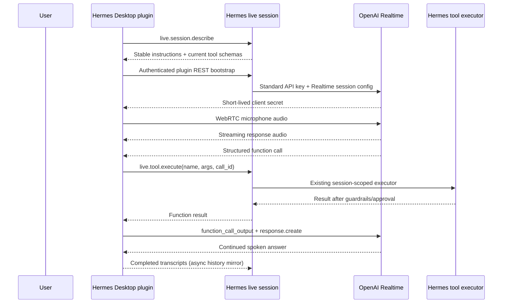

# Personal Hermes realtime voice architecture

Status: native Desktop milestone in validation

## Decision

Hermes is the harness and control plane. OpenAI Realtime is the inference model
for a live voice session, while GitHub Copilot remains the normal text/coding
provider. Realtime handles audio understanding, turn detection, interruption,
tool selection, and spoken output. Hermes owns the system context, tool catalog,
tool execution, approvals, session state, delegation, and memory.

This avoids the rejected transcript cascade. Input transcription is an
asynchronous history side channel; it never gates the spoken response.

Current official API choices:

- `gpt-realtime-2.1`
- WebRTC for client media
- `POST /v1/realtime/client_secrets` for short-lived renderer credentials
- Realtime function calling for Hermes tool selection

References: [WebRTC](https://developers.openai.com/api/docs/guides/realtime-webrtc),
[Realtime conversations](https://developers.openai.com/api/docs/guides/realtime-conversations).

## Data flow

The Realtime model has no direct filesystem, terminal, memory, or network
authority. The gateway rejects any function name absent from the active
Hermes session and serializes live tool calls. Existing Desktop approval and
clarification UI stays authoritative.

## Extension boundary

Versioned personal code lives under `personal/extensions/gpt-realtime-voice/`:

- `desktop/plugin.js`: WebRTC transport and Realtime event adapter.
- `dashboard/plugin_api.py`: authenticated client-secret bootstrap.
- `gpt_realtime_voice/openai_adapter.py`: provider-specific session shape.
- `install-dev.ps1`: development links into both runtime plugin directories.

The only shared-source changes are provider-neutral seams:

- `composer.liveVoice` lets a Desktop plugin replace the primary conversation engine.
- `live.session.describe`, `live.tool.execute`, and `live.transcript.append`
  expose a live Hermes session without adding a new model tool.

No OpenAI-specific code or credentials are in Hermes core.

## Security and later milestones

- The standard API key remains in `.local/home/.env` and only reaches OpenAI
  from the authenticated Hermes backend.
- The renderer gets a short-lived client secret and sends media directly to OpenAI.
- Spoken approval never auto-approves a Hermes action.
- Obsidian remains durable memory; the normal Hermes session is a working layer.
- Mobile needs authenticated HTTPS/device pairing and mobile audio lifecycle work.
- CarPlay needs a native iOS app, an approved entitlement/category, safe CarPlay
  templates, and App Store review. Desktop/WebRTC does not imply CarPlay support.

The provider adapter keeps model/session creation replaceable if GPT Live 1
becomes public without changing Hermes tool execution or the Desktop seam.
