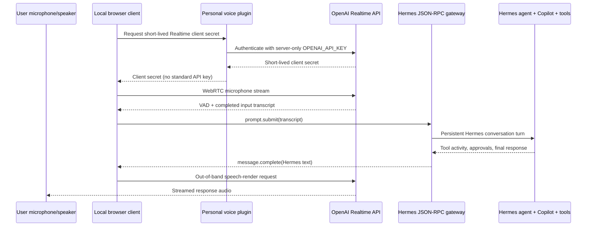

# Personal Hermes realtime voice architecture

Status: Milestone 1 local prototype

## Decision

Hermes is the control plane and only agent. OpenAI Realtime is an audio
transport, transcription, interruption, and speech-rendering layer. It does not
receive Hermes tools and does not own durable conversation state.

The current implementation uses `gpt-realtime-2.1`, WebRTC, and short-lived
client secrets. OpenAI recommends WebRTC for browser/mobile clients, and the GA
API creates browser credentials with `POST /v1/realtime/client_secrets`.

Official references:

- [Realtime and audio](https://developers.openai.com/api/docs/guides/realtime)
- [Realtime API with WebRTC](https://developers.openai.com/api/docs/guides/realtime-webrtc)
- [Managing Realtime conversations](https://developers.openai.com/api/docs/guides/realtime-conversations)
- [Create a Realtime client secret](https://developers.openai.com/api/reference/resources/realtime/subresources/client_secrets/methods/create)

## Data flow



Realtime session VAD has `create_response: false`, so user speech cannot cause
the Realtime model to bypass Hermes. `interrupt_response: true` preserves
barge-in while keeping response creation under the client bridge.

## Versioned and runtime layout

```text
personal/
  AGENTS.md
  extensions/
    gpt-realtime-voice/
      plugin.yaml
      __init__.py
      gpt_realtime_voice/   # CLI, server, provider adapter
      static/               # dependency-free mobile web client
      tests/
      install-dev.ps1
  docs/
    realtime-voice-architecture.md

.local/home/
  .env                      # OPENAI_API_KEY; ignored
  gpt-realtime-voice/       # generated privacy-safe installation id; ignored
  plugins/
    gpt-realtime-voice -> personal/extensions/gpt-realtime-voice
```

The implementation follows Hermes' general plugin API: a user plugin under
`$HERMES_HOME/plugins` registers `hermes voice` through
`ctx.register_cli_command`. It adds no core model tools and changes no core
files.

## Security model

Milestone 1:

- Bind only to loopback and refuse wildcard/LAN addresses.
- Validate peer, Host, and Origin to reduce local DNS-rebinding/CSRF risk.
- Keep the standard OpenAI API key server-side; return only short-lived client
  secrets with `Cache-Control: no-store`.
- Attach a stable, hashed, non-identifying OpenAI safety identifier.
- Rate-limit client-secret creation.
- Keep Hermes approval and clarification prompts explicit. Never convert a
  spoken phrase into automatic tool approval.
- Do not persist transcripts in the plugin. Hermes retains its normal session
  history; Obsidian remains the durable knowledge authority.

Remote/mobile milestone:

- Put the service behind HTTPS with an authenticated reverse proxy or a
  private-device tunnel. Do not expose the loopback prototype directly.
- Mint short-lived application sessions after user authentication, enforce
  origin allow-lists, and add per-user rate limits and revocation.
- Keep media browser-to-OpenAI over WebRTC; the Hermes control channel uses
  authenticated secure WebSockets.
- Add sleep/wake reconnection and phone audio-session tests before calling it a
  reliable mobile experience.

## Provider boundary

`RealtimeVoiceAdapter` owns client-secret/session creation and public transport
metadata. `OpenAIRealtimeAdapter` is the first implementation. A future GPT
Live 1 adapter can replace model/session/event mapping while the Hermes gateway,
approval UI, and client conversation flow remain unchanged.

## CarPlay boundary

Apple currently includes voice-based conversational apps among supported
CarPlay categories, but CarPlay is not a general browser projection surface.
A production CarPlay experience requires a native iOS client, an approved
CarPlay entitlement, category-appropriate templates/audio behavior, App Store
review, and testing in a real vehicle. The mobile web client is an architecture
probe, not a claim of CarPlay support.

- [Apple CarPlay overview](https://developer.apple.com/carplay/)
- [Requesting CarPlay entitlements](https://developer.apple.com/documentation/carplay/requesting-carplay-entitlements)

## Milestones

1. Local browser prototype: real microphone WebRTC, real OpenAI client-secret
   creation, persistent Hermes JSON-RPC turn, streamed spoken Hermes response.
2. Secure phone access: HTTPS/authentication, device pairing, reconnection, and
   mobile Safari validation.
3. Native iOS shell: background/audio-session lifecycle, lock-screen controls,
   and driving-focused interaction tests.
4. CarPlay feasibility: entitlement/category review and native template proof;
   proceed only if Apple's approval and safety constraints fit the product.
